Developing a non-violent videogame for Today's World
====================================================

by [devnari](http://devnari.com)

MinneBar12 3/25/2017 

Intro
---------
- Who are we
- What is Newt One?
- Level Play 4-5 min

Art Direction
-------------

 
Platform/Controller support
---------------------------
 - pc/mac is easy on Unity
 - linux was an early target, but early tests were not fun
 - JavaScript for Unity demo
 - controller support/[UnCL](http://devjana.net/uncl/api)
 
 
 
 - decision to go for XBOne
 
 
 
 - building for to XBOne

Level Design
------------

 

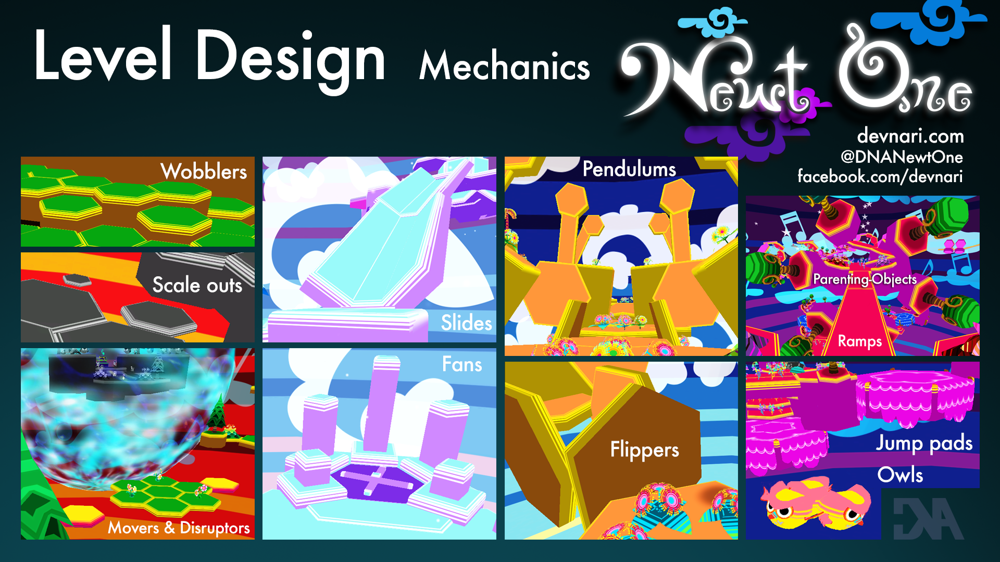

Level Music System
-------------------
- overview

- playable demo

Project Management/Evolution
----------------------------

Emergent Features/Adjustments
-----------------------------
- originally thought only back-forth movers would be enough

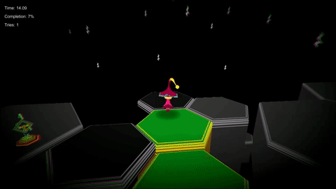

- started using movers in creative ways in level editors

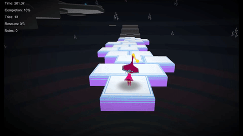

- evoled to pathing movers

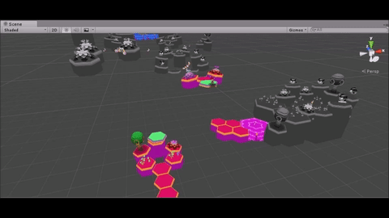

- one level needs path a mover that stops at last position

- *outfits/lives/notes/coins*
- started as coins

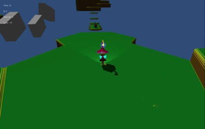

- 30/level
- became notes

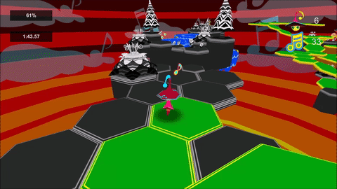

- 50 for an extra life

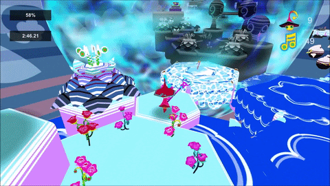

- asked "why do you have lives?" at MinneBar 2016
- observed many players stop playing when out of lives at TEDx Minne 2016
- now 50 for an outfit upgrade
- when player "dies" the respawn sound is more happy (respawn, not death)

- *Disruptors*
- started as Krystal's idea
- prototyped and iterated
- started as crystals only

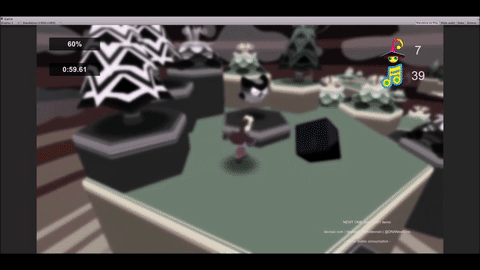
- evolved in a Slack convo
 
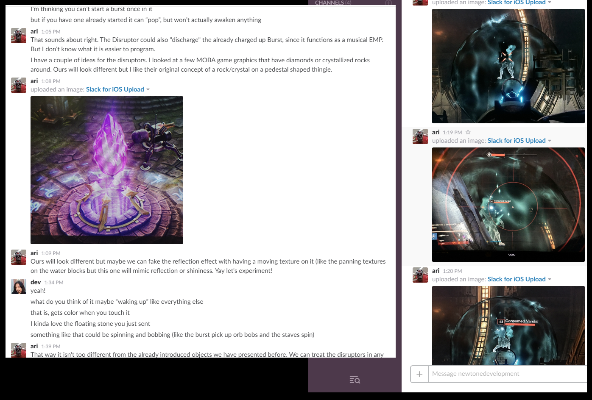

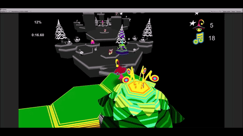
- juiced it

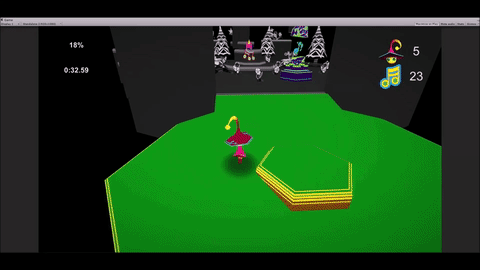
- added bubble

- *Leaderboards*
- still up from Alpha (http://devnari.com/newtOne/)
- too competitive for the game's philosophy

- *Enemies/NPCs*
- originally standard 3D platformer (jump on enemies)

Domains of Play, player interests profile
-----------------------------------------

Project Management
------------------
 - mostly agile
 - stories/tasks = ticket
 - git + bitbucket 
 - Ovrlord
 - moved to monthly builds
