Developing a non-violent videogame for Today's World
====================================================

by [devnari](http://devnari.com)

MinneBar12 3/25/2017 

Intro
---------
- Who are we
- What is Newt One?
- Level Play 4-5 min

Art Direction
-------------
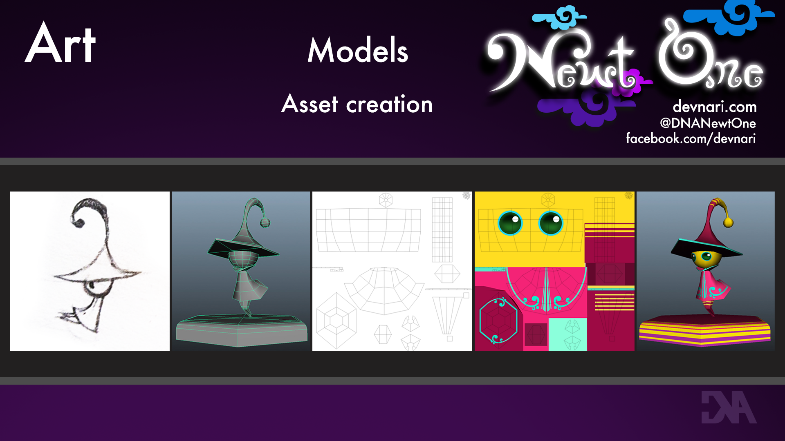

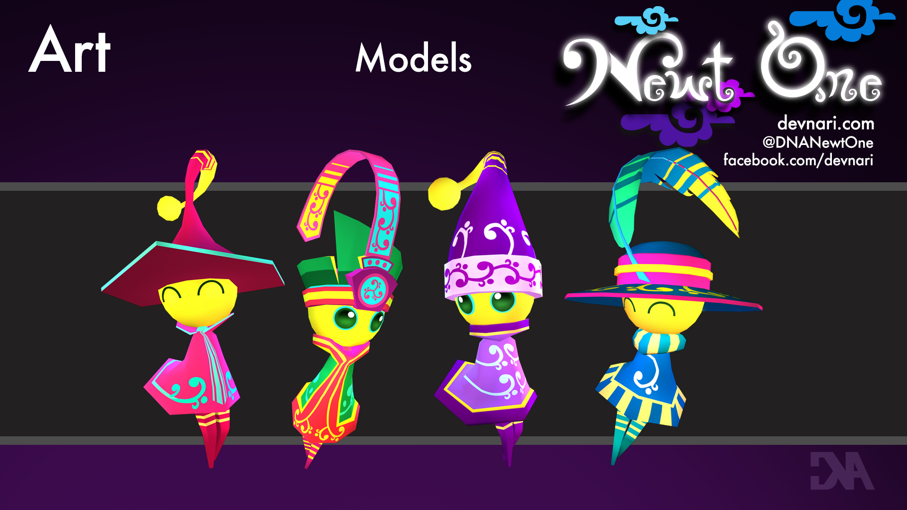

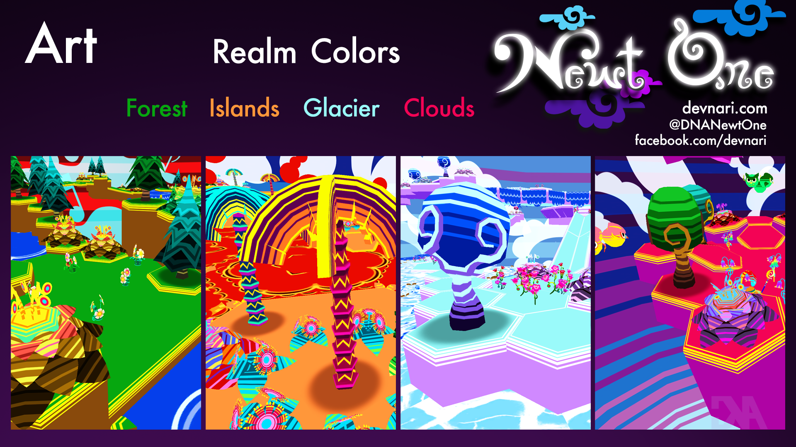

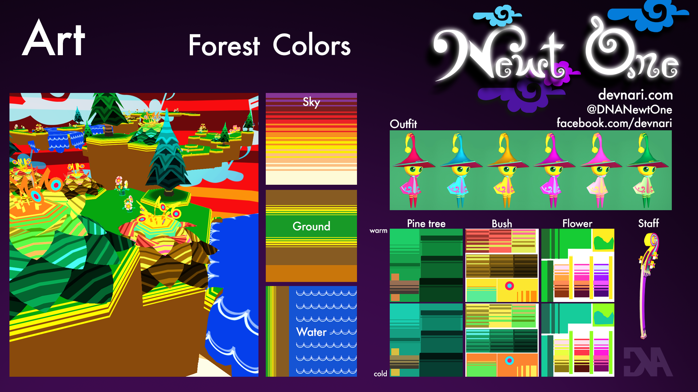

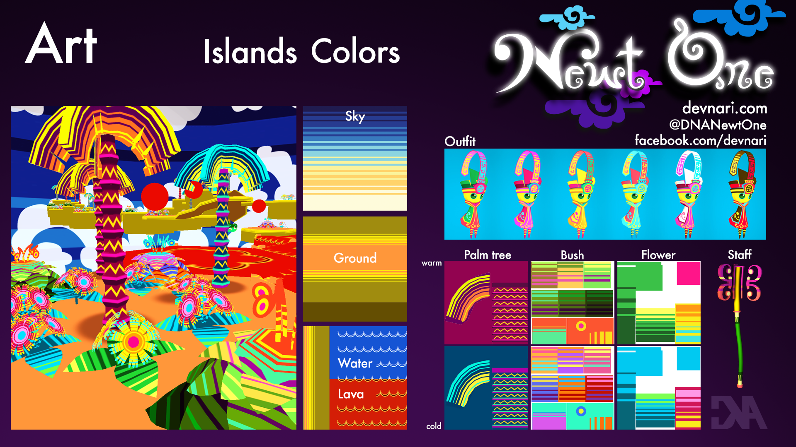

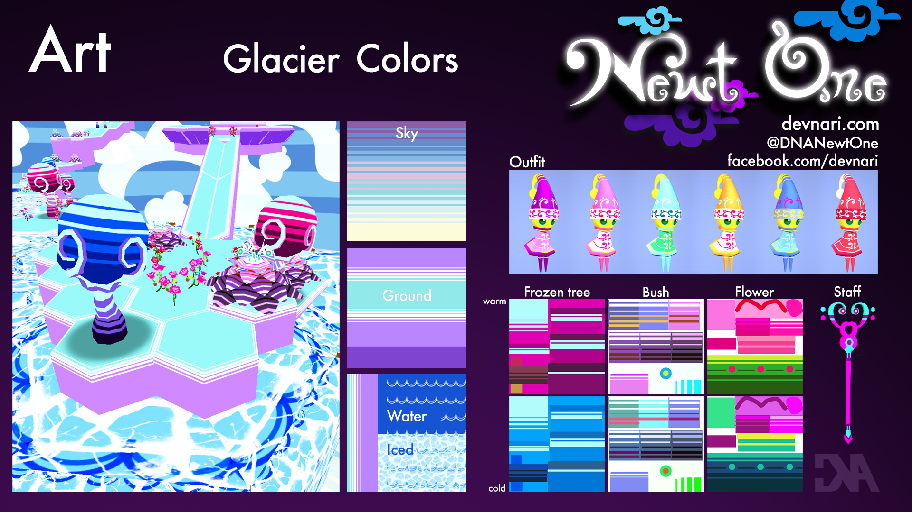

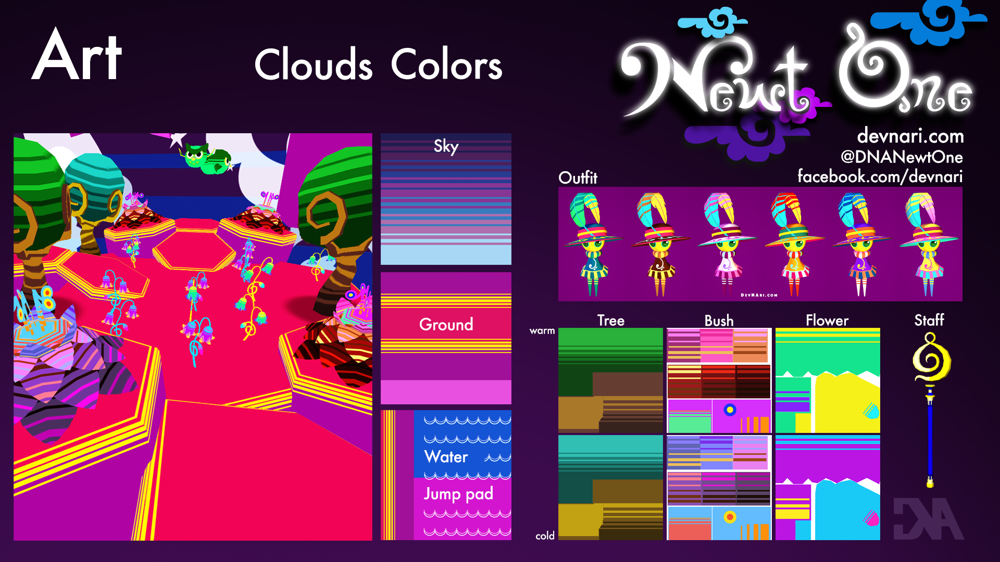

 
Platform/Controller support
---------------------------
 - pc/mac is easy on Unity
 - linux was an early target, but early tests were not fun
 - JavaScript for Unity demo
 - controller support/UnCL
 
 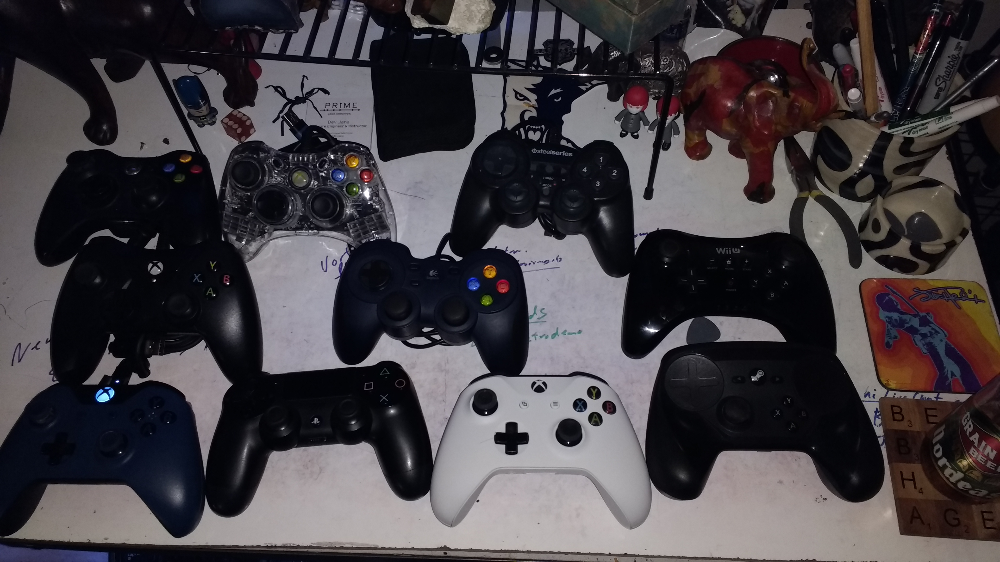
 
 - decision to go for XBOne
 
 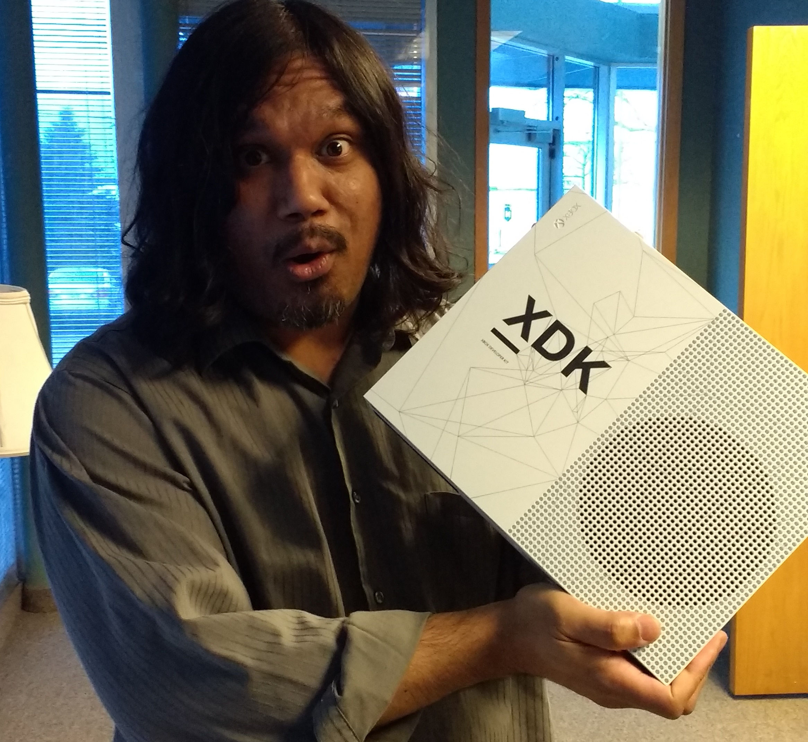
 
 - building for to XBOne
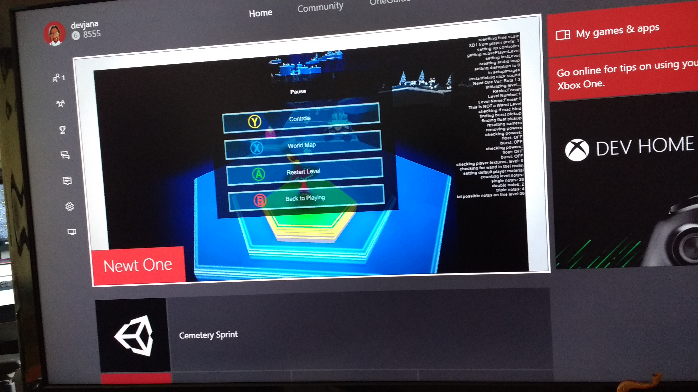

Level Design
------------

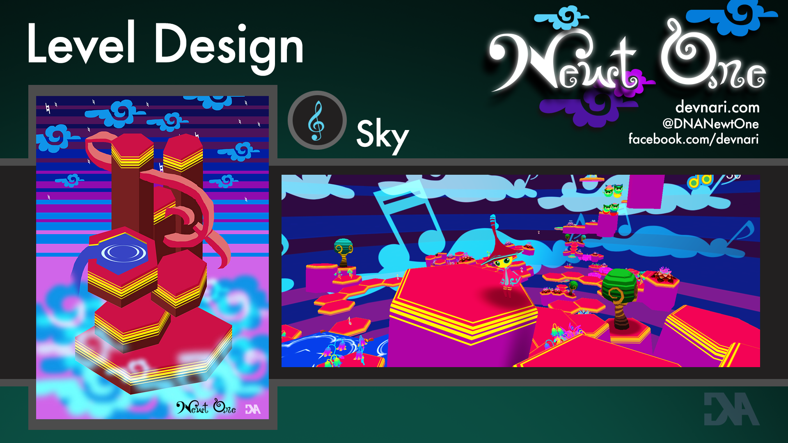

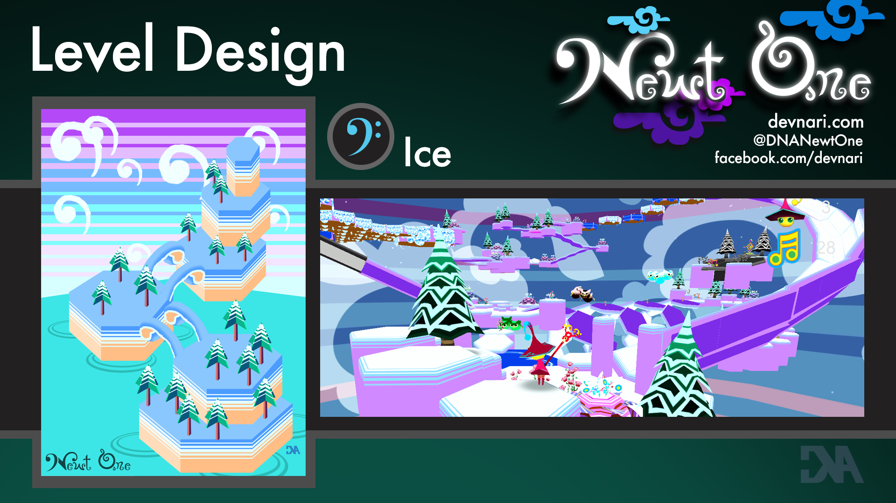

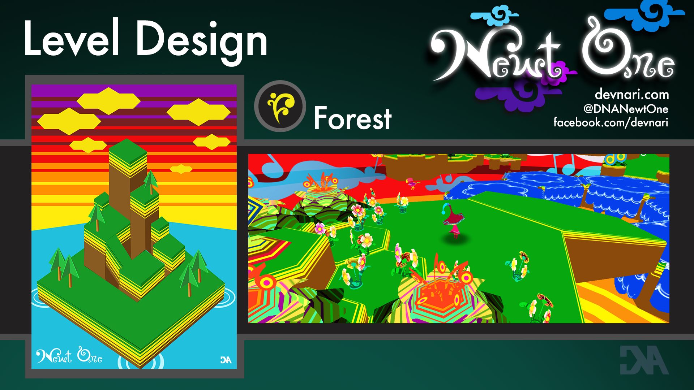
 
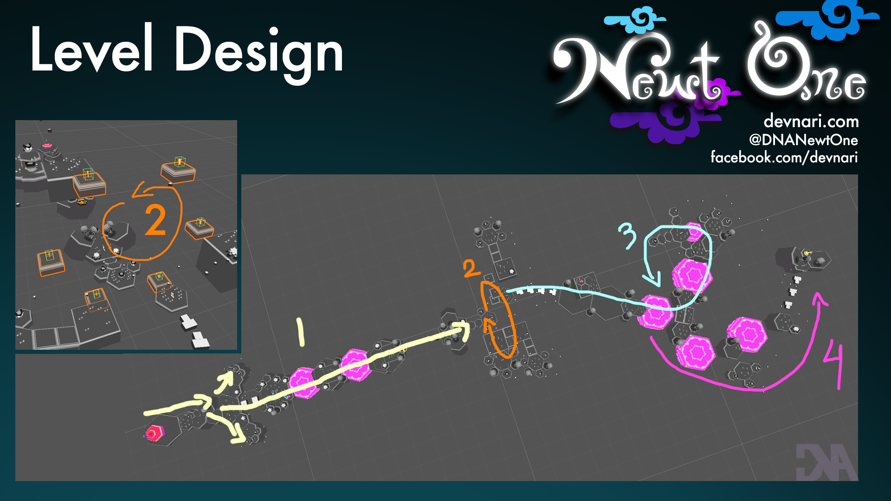

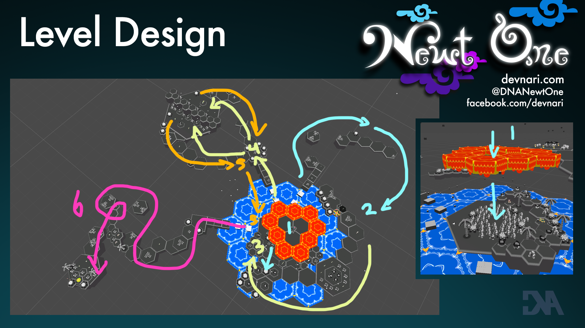

Level Music System
-------------------
- overview

- playable demo

Project Management/Evolution
----------------------------
 - Domains of Play, player interests profile
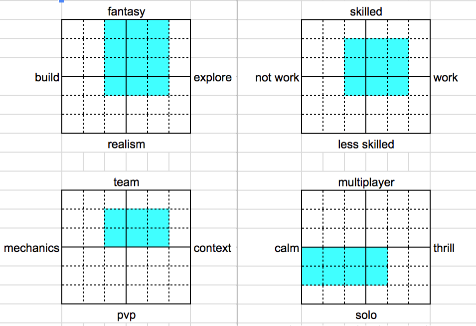
 - mostly agile
 - stories/tasks = ticket
 - git + bitbucket 
 - Ovrlord
 - moved to montly builds

End/QA
======
- time permitting
